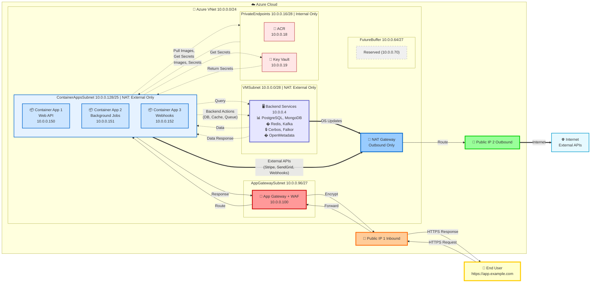

# Azure VNet Architecture with NAT Gateway, Security and Load Balancing | Development Environment

## Overview
This document outlines the complete Azure VNet architecture design for the development environment, incorporating NAT Gateway for outbound internet connectivity, security services, and load balancing from the initial setup.

**Architecture Approach**: This is a **greenfield deployment** with NAT Gateway integrated , ensuring secure outbound connectivity for all private resources without requiring individual public IPs.

---

## VNet Details
- **CIDR**: 10.0.0.0/24 (256 IPs total)
- **Usable after reservation**: 231 IPs
- **DDoS Protection**: Policy-based, no IP consumption
- **WAF**: Enabled on App Gateway, no extra IP
- **NAT Gateway**: Enabled for outbound connectivity (1 Public IP external to VNet)
- **Region**: East US (adjust as needed)
- **Architecture Type**: Greenfield deployment with NAT Gateway from inception

---

## 🌐 NAT Gateway Configuration

### What is NAT Gateway?
Azure NAT Gateway provides **outbound internet connectivity** for private subnet resources (VMs, Container Apps, Private Endpoints) without assigning public IPs to individual resources.

### NAT Gateway Benefits
✅ **Centralized Outbound**: Single point for all outbound internet traffic  
✅ **Security**: Resources don't need public IPs (reduced attack surface)  
✅ **Scalability**: Supports up to 64,000 simultaneous outbound connections per IP  
✅ **Cost-Effective**: One public IP serves entire subnet(s)  
✅ **No Configuration on Resources**: Automatic routing

### NAT Gateway Resource Requirements

| Component | IP Consumption | Resource Group | Notes |
|-----------|---------------|----------------|--------|
| **NAT Gateway** | 0 (control plane) | RG-Development | No IP in VNet |
| **Public IP (Standard SKU)** | 1 (external) | RG-Development | Outside VNet CIDR |
| **Subnet Association** | 0 | Attached to subnets | No additional IPs |

**Total VNet IP Impact**: **0 IPs** (NAT Gateway uses external Public IP)

---

## Subnet Allocation Table (With NAT Gateway)

| Subnet Name | CIDR | Total IPs | Usable IPs | Current Need | Buffer | Reserved IPs | Additional Services | NAT Gateway | Flexibility |
|-------------|------|-----------|------------|--------------|--------|--------------|---------------------|-------------|-------------|
| **AppGatewaySubnet** | 10.0.0.96/27 | 32 | 27 | 1 (App Gateway + WAF) | 26 | 5 | WAF (no extra IP) | ❌ No | Fixed |
| **VMSubnet** | 10.0.0.0/28 | 16 | 11 | 1 (VM) | 8 | 5 | 1 LB (1 IP) | ✅ **Yes** | Flexible |
| **ContainerAppsSubnet** | 10.0.0.128/25 | 128 | 123 | ~75 (Container Apps) | 48 | 5 | None | ✅ **Yes** | Fixed |
| **PrivateEndpoints** | 10.0.0.16/28 | 16 | 11 | ~10 (Private Endpoints) | 6 | 5 | 1 LB (1 IP) | ✅ **Yes** | Flexible |
| **FutureBuffer** | 10.0.0.64/27 | 32 | 27 | 0 | 27 | 5 | Future security services | ✅ **Yes** | Flexible |

### Subnet-by-Subnet NAT Gateway Assignment

#### ❌ AppGatewaySubnet - NO NAT Gateway
**Reason**: App Gateway has built-in public IP for inbound/outbound traffic. NAT Gateway would conflict.

#### ✅ VMSubnet - NAT Gateway ENABLED
**Purpose**: VMs need outbound internet for:
- Package updates (`apt-get`, `yum`)
- Docker image pulls from Docker Hub
- GitHub Actions runner communication
- Azure CLI/SDK operations

#### ✅ ContainerAppsSubnet - NAT Gateway ENABLED
**Purpose**: Container Apps need outbound for:
- Pulling container images from ACR
- External API calls
- Database connections (if external)
- Third-party service integrations

#### ✅ PrivateEndpoints - NAT Gateway ENABLED
**Purpose**: Resources connecting via Private Endpoints may need:
- Azure service management operations
- Monitoring/logging to external services
- Backup operations

#### ✅ FutureBuffer - NAT Gateway ENABLED (Pre-configured)
**Purpose**: Ready for future services requiring outbound connectivity

---

## 🏗️ Architecture Diagram



### Architecture Flow Legend

| Symbol | Meaning |
|--------|---------|
| **👤 Yellow** | End User / Browser Entry Point |
| **① → ⑩ Numbers** | **Complete User Journey** (Request → DB → Secrets → Response) |
| **→** (Solid Arrow) | Numbered user request/response flow |
| **-.->** (Dashed Blue) | 🔷 **Internal VNet communication (No NAT)** - ACR, DB, Cache, Queue, KV |
| **==>** (Thick Orange) | 🔶 **External internet traffic (Via NAT Gateway)** - Stripe, SendGrid, OS Updates |
| **� Red** | Application Gateway + WAF (User entry point) |
| **� Blue** | NAT Gateway (External internet only) |
| **� Orange/Green** | Public IPs (40.121.45.67 - Inbound, 52.168.10.55 - Outbound) |
| **📦 Light Blue** | Container Apps (Backend services) |
| **🐳🗄️� Pink** | Private Endpoints (ACR, SQL, Key Vault) - Internal only |
| **🖥️ Purple** | VM (GitHub Runner - Direct IP 10.0.0.4, no ILB) |

### Communication Paths

| Source | Destination | Path | NAT Gateway? | Purpose |
|--------|-------------|------|--------------|---------|
| **User Browser** | App Gateway | Public IP 1 (40.121.45.67) | ❌ No (Inbound) | HTTPS web access |
| **Container Apps** | VM Backend | Internal VNet (10.0.0.4) | ❌ No | PostgreSQL, MongoDB, Redis, Kafka queries |
| **VM Backend** | Container Apps | Internal VNet (response) | ❌ No | Data, Cache results, Event confirmations |
| **Container Apps** | Private Endpoints | Internal VNet (10.0.0.18-19) | ❌ No | Pull Docker images, Get secrets |
| **Private Endpoints** | Container Apps | Internal VNet (response) | ❌ No | Images, Secrets, Credentials |
| **Container Apps** | External APIs | Via NAT Gateway → Internet | ✅ Yes | Stripe, SendGrid, Webhooks |
| **VM Backend** | OS Updates | Via NAT Gateway → Internet | ✅ Yes | apt-get, yum, security patches |

### User Access Flow (Primary Journey)

**Inbound Request (User → App):**
```
User → App Gateway (40.121.45.67) → Container Apps (10.0.0.150-152)
```

**Internal Operations (dotted lines - no NAT):**
```
Container Apps ↔ VM Backend (10.0.0.4)
  - PostgreSQL: Relational database queries
  - MongoDB: NoSQL document operations
  - Redis: Caching and session storage
  - Kafka: Event streaming and messaging
  - Cerbos: Authorization checks
  - Falkor: Data governance operations
  - OpenMetadata: Metadata discovery

Container Apps ↔ Private Endpoints (10.0.0.18-19)
  - Pull Docker images from ACR
  - Get secrets from Key Vault
```

**Outbound Response (App → User):**
```
Container Apps → App Gateway → User (HTTPS Response)
```

**External Operations (thick lines - via NAT):**
```
Container Apps → NAT Gateway → Internet
  - Stripe payment API
  - SendGrid email service
  - External webhooks

VM Backend → NAT Gateway → Internet
  - OS updates (apt-get, yum)
  - Security patches
  - Database/service updates
```

**Entry Point**: `https://app.example.com` → App Gateway Public IP (e.g., 40.121.45.67)  
**Response Time**: App Gateway → Container Apps → Response (typical: 50-200ms)

### DNS Configuration for User Access

| Component | Configuration | Example Value | Purpose |
|-----------|--------------|---------------|---------|
| **Custom Domain** | A Record | app.example.com | User-friendly URL |
| **DNS Target** | App Gateway Public IP | 40.121.45.67 | Points to inbound entry |
| **SSL Certificate** | App Gateway Listener | *.example.com | HTTPS encryption |
| **Backend Pool** | Container Apps | 10.0.0.128/25 | Application targets |
| **Health Probe** | HTTP/HTTPS endpoint | /health or /api/health | Backend availability check |

**DNS Setup Example**:
```
Type: A
Host: app (or @)
Points to: 40.121.45.67 (App Gateway Public IP)
TTL: 3600

Type: CNAME (alternative)
Host: app
Points to: appgw-dev-eastus.cloudapp.azure.com
TTL: 3600
```

**User Experience**:
1. User types `https://app.example.com` in browser
2. DNS resolves to App Gateway Public IP (40.121.45.67)
3. HTTPS connection established with App Gateway
4. App Gateway terminates SSL and inspects with WAF
5. Request forwarded to healthy Container App backend
6. Container App processes and returns response
7. App Gateway encrypts and sends response to user

### Private Endpoint Configuration for ACR

**Why Private Endpoint for ACR?**
✅ **No NAT Gateway needed** - Images pulled over internal VNet  
✅ **Faster image pulls** - No internet latency  
✅ **More secure** - No public exposure of container registry  
✅ **Lower costs** - No NAT Gateway data processing charges for image pulls  
✅ **Private DNS integration** - Automatic name resolution

**ACR Private Endpoint Setup**:
```
Resource: Azure Container Registry (ACR)
Private Endpoint: 10.0.0.18
DNS Zone: privatelink.azurecr.io
Container Apps Access: myregistry.azurecr.io → 10.0.0.18 (internal)
```

**Traffic Flow for Image Pull**:
```
Container App (10.0.0.150) 
  → Internal VNet routing
  → Private Endpoint ACR (10.0.0.18)
  → ACR Backend (privatelink.azurecr.io)
  
✅ NO NAT Gateway involved
✅ NO Public Internet traffic
✅ NO additional data processing costs
```

---

## 📋 Resource Inventory with NAT Gateway

| Resource Type | Count | IP Consumption (VNet) | IP Consumption (External) | Location | Notes |
|--------------|-------|----------------------|--------------------------|----------|-------|
| **App Gateway** | 1 | 1 IP (10.0.0.100) | 1 Public IP | AppGatewaySubnet | Has dedicated public IP for inbound |
| **WAF Policy** | 1 | 0 IPs | 0 IPs | Attached to App Gateway | No additional IP |
| **VM (GitHub Runner)** | 1 | 1 IP (10.0.0.4) | 0 IPs | VMSubnet | Uses NAT for outbound |
| **Load Balancer (VM)** | 1 | 1 IP (10.0.0.5) | 0 IPs | VMSubnet | Internal LB |
| **Container Apps** | Multiple | ~75 IPs | 0 IPs | ContainerAppsSubnet | Uses NAT for outbound |
| **Private Endpoints** | ~10 | ~10 IPs | 0 IPs | PrivateEndpoints | Uses NAT for outbound |
| **Load Balancer (PE)** | 1 | 1 IP | 0 IPs | PrivateEndpoints | Internal LB |
| **NAT Gateway** | 1 | 0 IPs (control plane) | 1 Public IP | VNet-level resource | Shared across subnets |
| **DDoS Protection** | 1 | 0 IPs | 0 IPs | Policy-based | No IP consumption |
| **Total VNet IPs Used** | - | ~89 IPs | - | - | 142 IPs remaining |
| **Total Public IPs** | - | - | 2 IPs | - | App Gateway + NAT Gateway |

### Public IP Summary

| Public IP | Purpose | SKU | Associated With | Inbound/Outbound |
|-----------|---------|-----|-----------------|------------------|
| **Public IP 1** | Inbound traffic | Standard | App Gateway | Inbound |
| **Public IP 2** | Outbound traffic | Standard | NAT Gateway | Outbound Only |

**Key Point**: Only **2 external Public IPs** are required for the entire development environment, regardless of the number of VMs or Container Apps deployed.

st for Development Environment**: **$40-80/month** (depending on outbound traffic volume)

### Total Infrastructure Cost Breakdown

| Component | Monthly Cost | Notes |
|-----------|-------------|-------|
| **App Gateway (Standard v2)** | ~$125/month | Inbound traffic handling + WAF |
| **NAT Gateway + Public IP** | ~$36-80/month | Outbound connectivity for all resources |
| **VMs (B2s - 2 vCPU, 4GB)** | ~$30/month | GitHub self-hosted runner |
| **Container Apps Environment** | ~$50/month | Control plane + agent pools |
| **Container Apps Instances** | Variable | Based on CPU/memory consumption |
| **Storage (ACR, Logs)*---

### Security Architecture

```
┌─────────────────────────────────────────────────────────────────┐
│                     Security Layers                             │
├─────────────────────────────────────────────────────────────────┤
│  Layer 1: Azure Firewall / NSG Rules (Traffic Filtering)       │
│  Layer 2: DDoS Protection (Public IP Protection)               │
│  Layer 3: WAF (Application Layer Security - App Gateway)       │
│  Layer 4: Private Networking (No Public IPs on resources)      │
│  Layer 5: NAT Gateway (Controlled Outbound Only)               │
└─────────────────────────────────────────────────────────────────┘
```

### Network Security Group (NSG) Recommendations

**VMSubnet NSG Rules**:
| Priority | Name | Direction | Access | Protocol | Destination | Port | Purpose |
|----------|------|-----------|--------|----------|-------------|------|---------|
| 100 | AllowHTTPS | Outbound | Allow | TCP | Internet | 443 | GitHub, Docker Hub |
| 110 | AllowHTTP | Outbound | Allow | TCP | Internet | 80 | Package updates |
| 120 | AllowDNS | Outbound | Allow | UDP | VNet | 53 | DNS resolution |
| 4000 | DenyAllOutbound | Outbound | Deny | Any | Any | Any | Default deny |

**ContainerAppsSubnet NSG Rules**:
| Priority | Name | Direction | Access | Protocol | Destination | Port | Purpose |
|----------|------|-----------|--------|----------|-------------|------|---------|
| 100 | AllowHTTPS | Outbound | Allow | TCP | Internet | 443 | API calls, ACR pulls |
| 110 | AllowSQL | Outbound | Allow | TCP | SQL | 1433 | Database access |
| 120 | AllowDNS | Outbound | Allow | UDP | VNet | 53 | DNS resolution |
| 4000 | DenyAllOutbound | Outbound | Deny | Any | Any | Any | Default deny |

### Monitoring & Compliance

**Enable NSG Flow Logs**: Track all traffic patterns
```
- Source IP: Internal (10.0.0.x)
- NAT Translation: External (NAT Gateway Public IP)
- Destination: External services
- Status: Allowed/Denied
```

**Azure Monitor Alerts**:
- Unusual outbound traffic volume
- New destination IPs accessed
- SNAT port exhaustion warnings
- Failed connection attempts

**Compliance Benefits**:
- ✅ CIS Azure Foundations Benchmark compliance
- ✅ NIST 800-53 network segmentation requirements
- ✅ PCI-DSS network isolation standards
- ✅ SOC 2 Type II audit trail requirements

## � Architecture Summary

### NAT Gateway Integration Benefits

| Aspect | Value Proposition |
|--------|------------------|
| **Outbound Internet** | Centralized via NAT Gateway (all resources share single egress point) |
| **IP Address Management** | Simplified (2 external public IPs for entire environment) |
| **Security Posture** | Enhanced (resources have no public IPs, zero inbound exposure via NAT) |
| **Cost** | $36/month flat + data processing (vs $277/month for per-resource public IPs) |
| **🖥️ Purple** | VM (GitHub Runner - Direct IP 10.0.0.4, no ILB) |
| **Monitoring** | Centralized metrics and logs for all outbound traffic |
| **VNet IP Usage** | 89 of 231 IPs (38%) - NAT Gateway uses external Public IP |

### Resources in This Architecture

| **Container Apps** | VM Backend | Internal VNet (10.0.0.4) | ❌ No | PostgreSQL, MongoDB, Redis, Kafka queries |
- ✅ Azure Virtual Network (10.0.0.0/24)
| **Container Apps** | Private Endpoints | Internal VNet (10.0.0.18-19) | ❌ No | Pull Docker images, Get secrets |
- ✅ Application Gateway with Standard Public IP (inbound web traffic)
- ✅ 5 subnets (App Gateway, Container Apps, VM, Private Endpoints, FutureBuffer)

**Subnet NAT Gateway Associations**:
- ✅ VMSubnet → NAT Gateway (GitHub runners need internet for GitHub/Docker Hub)
- ✅ ContainerAppsSubnet → NAT Gateway (apps need outbound for APIs/webhooks)
| User → App Gateway (40.121.45.67) → Container Apps (10.0.0.150-152)
- ✅ FutureBuffer → NAT Gateway (reserved for future workloads)
- ❌ AppGatewaySubnet → No NAT (has dedicated public IP for inbound traffic)

**Monitoring & Security**:
| Container Apps ↔ VM Backend (10.0.0.4)
- ✅ NSG Flow Logs enabled
- ✅ Azure Monitor metrics and alerts
- ✅ DDoS Protection on public IPs
- ✅ Centralized audit trail (all outbound via single IP)
| Container Apps → NAT Gateway → Internet
---


## 📚 Additional Resources

- [Azure NAT Gateway Documentation](https://docs.microsoft.com/azure/virtual-network/nat-gateway/)
- [NAT Gateway Pricing](https://azure.microsoft.com/pricing/details/virtual-network/)
- [NAT Gateway Design Patterns](https://docs.microsoft.com/azure/architecture/networking/guide/nat-gateway)
- [Troubleshooting NAT Gateway](https://docs.microsoft.com/azure/virtual-network/nat-gateway/troubleshoot-nat)
- [NAT Gateway Metrics](https://docs.microsoft.com/azure/azure-monitor/essentials/metrics-supported#microsoftnetworknatgateways)

---


**Document Version**: 1.0  
**Last Updated**: November 26, 2025  

