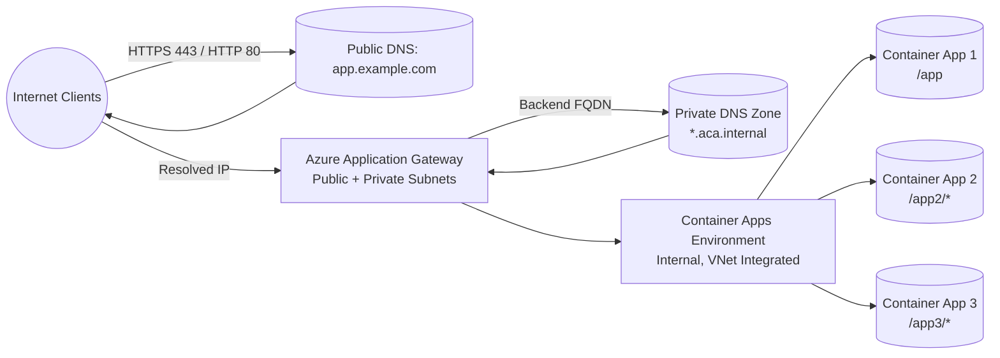

# Exposing Azure Container Apps via Application Gateway

This walkthrough demonstrates how to publish three internal Azure Container Apps behind a single Azure Application Gateway using path-based routing for both HTTP and HTTPS. The accompanying Terraform configuration provisions every platform component except the virtual network and subnets, which are assumed to exist already.

## Architecture Overview



### High-Level Flow
- Users browse to `http(s)://app.example.com/...` and land on the Application Gateway public IP.
- Path-based routing decides which backend pool to use (`/`, `/app2/*`, `/app3/*`).
- Application Gateway resolves each Container App FQDN through the private DNS zone and forwards traffic over the VNet.
- The internal Container Apps Environment distributes requests to the correct app revision.

## Terraform Contents
| File | Purpose |
| --- | --- |
| `main.tf` | Providers, Container Apps Environment, applications, private DNS zone, public IP, and Application Gateway with routing rules. |
| `variables.tf` | Declarative input variables (resource group, subnets, hostname, certificate, container definitions, etc.). |
| `outputs.tf` | Helpful values after deployment (gateway public IP, FQDNs, DNS zone name, etc.). |

## Prerequisites
- Azure resource group in the desired subscription and region.
- Existing virtual network with:
  - Delegated subnet for Azure Container Apps (`Microsoft.App/environments`).
  - Dedicated subnet for Application Gateway (no other resources, not delegated).
- DNS domain name you control for the public hostname.
- PFX certificate for that hostname (or access to Key Vault to export it) to terminate TLS on Application Gateway.
- Terraform 1.5+ and Azure CLI (or Managed Identity) for authentication.

## Usage
1. **Clone & initialize**
   ```powershell
   cd terraform\azure
   terraform init
   ```

2. **Provide inputs** via `terraform.tfvars` or CLI flags. Example:
   ```hcl
   resource_group_name      = "rg-app-containers"
   location                 = "eastus"
   virtual_network_id       = "/subscriptions/<sub>/resourceGroups/<rg>/providers/Microsoft.Network/virtualNetworks/vnet-hub"
   container_app_subnet_id  = "/subscriptions/<sub>/resourceGroups/<rg>/providers/Microsoft.Network/virtualNetworks/vnet-hub/subnets/snet-container-apps"
   app_gateway_subnet_id    = "/subscriptions/<sub>/resourceGroups/<rg>/providers/Microsoft.Network/virtualNetworks/vnet-hub/subnets/snet-app-gateway"
  public_hostname          = "app.example.com"
  enable_https             = false # flip to true and supply cert inputs to enable HTTPS listener
   gateway_certificate_data = filebase64("certs/app-example-com.pfx")
   gateway_certificate_password = var.certificate_password
   container_apps = [
     {
       name        = "app1"
       image       = "mcr.microsoft.com/azuredocs/containerapps-helloworld:latest"
       target_port = 80
       path        = "/"
       is_default  = true
     },
     {
       name        = "app2"
       image       = "mcr.microsoft.com/azuredocs/containerapps-helloworld:latest"
       target_port = 80
       path        = "/app2/*"
     },
     {
       name        = "app3"
       image       = "mcr.microsoft.com/azuredocs/containerapps-helloworld:latest"
       target_port = 80
       path        = "/app3/*"
     }
   ]
   ```

    > **Testing via raw IP?** Set `public_hostname = null`. Terraform will create a basic HTTP listener without Host header filtering, so you can browse directly to the Application Gateway public IP while validating the deployment. When ready to enforce DNS routing, restore the hostname and re-apply to switch back to a multi-site listener.

3. **Deploy**
   ```powershell
   terraform apply
   ```
   Confirm the plan and wait for completion.

4. **Post-deployment steps**
  - If `enable_https = true`, be sure the uploaded PFX covers `public_hostname` and update DNS before testing HTTPS.
  - Create/Update your public DNS `A` or `CNAME` record to point `public_hostname` to the gateway public IP or DNS name from the outputs.
   - Ensure NSGs or firewalls allow traffic between the Application Gateway subnet and the Container Apps subnet/subnet route tables.

## Validation Checklist
- `nslookup <container-app-fqdn>` from a host in the VNet resolves to the Container Apps internal IP.
- Application Gateway **Backend health** reports all pools as **Healthy**.
- Browsing `/`, `/app2`, `/app3` returns the correct application responses over both HTTP and HTTPS.

## Cleanup
Destroy all resources (except the shared VNet/subnets) when finished:
```powershell
terraform destroy
```

## References
- [Azure Container Apps networking concepts](https://learn.microsoft.com/azure/container-apps/networking)
- [Application Gateway path-based routing](https://learn.microsoft.com/azure/application-gateway/tutorial-url-route-portal)
- [Terraform AzureRM provider docs](https://registry.terraform.io/providers/hashicorp/azurerm/latest/docs)


https://github.com/microsoft/azure-container-apps/issues/1613