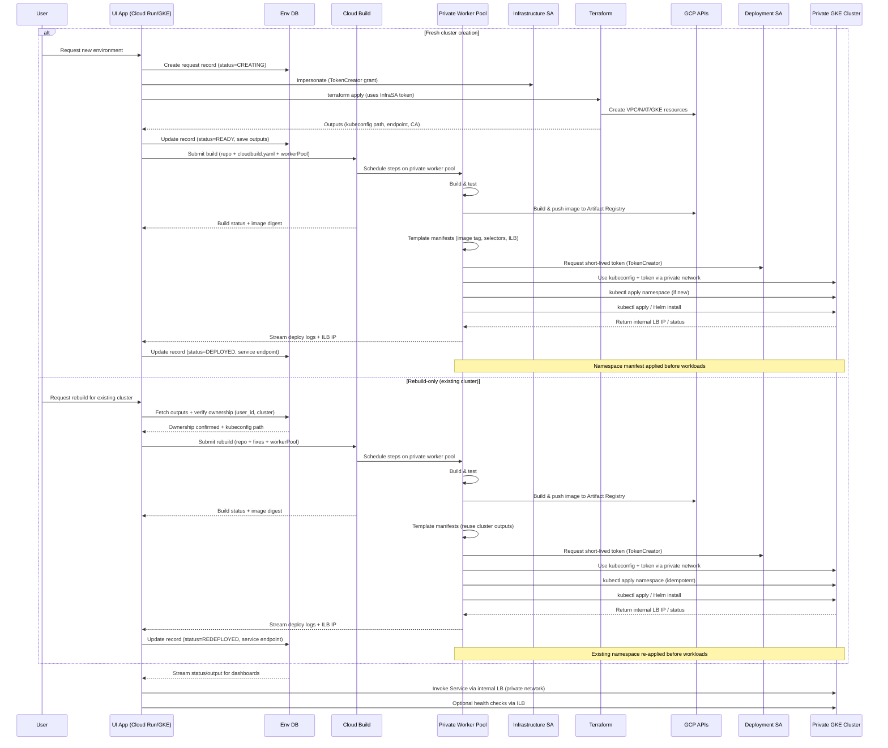

# Automated Tenant Environment Provisioning & Deployment Overview

This guide describes an end-to-end control plane where a customer-facing app (Cloud Run, GKE, or VM) provisions isolated tenant infrastructure on GCP: custom VPC + private GKE cluster, CPU/GPU node pools, Cloud NAT, Artifact Registry, internal load-balanced workloads, and Cloud Build-driven container pipelines. Terraform handles the platform build, while short-lived service account impersonation, Cloud SQL tracking, and manifest templating let the app deploy workloads, expose them privately, and decommission everything safely.

See `GCP-SERVICES.md` for a quick summary of every Google Cloud service referenced in this architecture.

## Components

1. **UI/App tier** – A service (Cloud Run or GKE) that receives user requests to spin up environments.
2. **Infrastructure SA** – Identity used to run Terraform. Has project-level roles required to create VPC, NAT, and the target GKE cluster.
3. **Deployment SA** – Identity mapped to Kubernetes RBAC for applying manifests to the new cluster. No broad project-level permissions.
4. **Terraform module (this repo)** – Builds VPC/subnet, secondary ranges, private GKE cluster, CPU/GPU node pools, Cloud NAT, a regional Artifact Registry repository, a private Cloud Build worker pool, and emits a kubeconfig file plus sensitive outputs (endpoint, CA, token).
5. **Private GKE cluster** – Lives entirely inside the custom VPC; reachable only from peered/bastion networks.
6. **Cloud Build private worker pool** – Regional worker pool pinned to the same VPC so builds and kubectl stages can reach the private cluster without exposing public IPs.

## Control Plane Delivery & CI/CD

- **Source of truth** – The main control-plane code base lives in GitHub. Repository branches gate all UI/API changes (Terraform definitions remain in this repo).
- **GitHub Actions pipeline** – GitHub Actions builds and tests the control-plane container, pushes it to Artifact Registry, and deploys the runtime to either Cloud Run (preferred serverless option) or a management GKE cluster. The workflow uses Workload Identity Federation or short-lived impersonation tokens so no static JSON keys are stored.
- **Deployment targets** – `gcloud run deploy` handles Cloud Run rollouts; a parallel job can run `kubectl` against the management GKE cluster when a long-lived control-plane deployment is required. Both options are fronted by Application Gateway for HTTPS ingress.
- **Integration with Cloud Build** – After the control-plane service ships, it alone holds permissions to call the Cloud Build API. End users interact only with the UI; the service authenticates to Cloud Build on their behalf, attaching the Terraform-emitted `worker_pool_id` to every tenant build request.
- **Secrets & configs** – GitHub Actions retrieves kubeconfigs, App Gateway hostnames, and Cloud Run service revisions from Secret Manager, keeping parity with the runtime configuration consumed by the deployed app.

## Flow Overview

1. **User request** – An authenticated user triggers “create environment” in the UI.
2. **Terraform run** – The app impersonates the infrastructure SA and launches `terraform apply`. Required IAM (minimum):
   - `roles/container.admin` (or custom equivalent) – Manage clusters/node pools.
   - `roles/compute.networkAdmin` – Create VPC/subnets/routers.
   - `roles/compute.securityAdmin` – Manage firewall/NAT.
   - `roles/serviceusage.serviceUsageAdmin` – Enable required APIs.
   - Optional: `roles/iam.serviceAccountUser` if Terraform binds workload identities.
3. **Infra provisioning** – Terraform creates the private cluster and writes a kubeconfig (`local_file.kubeconfig`) containing:
   - Private endpoint
   - Cluster CA certificate
   - OAuth token from the current auth context (short-lived)
4. **Build + deploy pipeline** – The UI submits a Cloud Build run that references the Terraform-provisioned private worker pool. Pipeline steps:
   - Build/test the workload, then push the image to Artifact Registry.
   - Impersonate the **Deployment SA** (Cloud Build SA needs `roles/iam.serviceAccountTokenCreator` on it) to mint a short-lived Kubernetes token during the deploy stage.
5. **Kubernetes access (worker pool)** – The pipeline downloads the kubeconfig path emitted by Terraform (GCS/Secret Manager) and combines it with the impersonated token. Because the worker pool subnets live inside the same VPC, kubectl traffic reaches the private control plane without extra proxies.
6. **Workload deployment** – The final Cloud Build stage (still running on the private worker pool) applies the namespace manifest, then Helm/kubectl bundles, sets GPU/CPU selectors, and emits internal load-balancer IPs that get written back to the request datastore.

## User Flow Diagram



## Routing, TLS, and Monitoring

- **Application Gateway + managed SSL** – Terminate HTTPS for the control-plane UI (Cloud Run or management GKE) using Google-managed certificates. Application Gateway handles path-based routing to the UI, any auxiliary APIs, and health dashboards without custom proxies.
- **Internal load balancers** – Tenant workloads stay reachable only over internal HTTP(S)/TCP load balancers. The Cloud Build deploy step captures each ILB IP and returns it to the app so records stay in sync.
- **Cloud Monitoring & Logging** – Use Cloud Monitoring dashboards (optionally Managed Service for Prometheus) to observe GKE cluster health, Cloud Build success rates, Application Gateway traffic, and Cloud Run/GKE control-plane metrics. Cloud Logging + log-based metrics drive alerting for failed builds, App Gateway errors, or namespace deployment issues.
- **Synthetic checks** – Schedule Cloud Monitoring uptime checks or Cloud Run jobs that call each tenant ILB through the management VPC, updating the datastore with health status alongside the ILB IP.

## Detailed Steps

1. **App scope**
   - App is deployed in a management project/environment with VPC connectivity (Cloud Run with Serverless VPC Connector, or a management GKE cluster peered into the target VPC).
   - App has permissions: `roles/iam.serviceAccountTokenCreator` on both Infrastructure SA and Deployment SA.

2. **Provisioning**
   - App writes/updates a `terraform.tfvars` with tenant-specific values (project, cluster name, CIDRs, optional `kubeconfig_path`).
   - Persist `user_id`, `tenant_id`, and the desired Kubernetes `namespace` in the datastore alongside the Terraform input snapshot so later rebuilds can verify ownership. Once Terraform finishes, store the emitted `worker_pool_id` so future Cloud Build runs automatically reference the correct private pool.
   - App invokes Terraform (CLI, Cloud Build, or TF Cloud) under Infrastructure SA impersonation.
   - Terraform builds the environment and emits outputs:
     - `cluster_endpoint`
     - `cluster_ca_certificate` (sensitive)
     - `gke_access_token` (sensitive, short-lived from Infra SA)
     - `kubeconfig_file_path`
     - `cloud_nat_details`
      - `cloud_build_worker_pool` (worker pool resource string + region for Cloud Build `workerPool` field)

3. **Rebuild-only / redeploy path**
   - Provide a "Rebuild & Deploy" action in the UI that only appears for clusters already owned by the signed-in user and whose Terraform status is `READY`, `DEPLOYED`, or `FAILED`.
   - When the user selects a cluster, query the datastore for `cluster_name`, `tenant_id`, `namespace`, `user_id`, `tf_state_uri`, `kubeconfig_path`, and last known image digest. Reject the request if any of those ownership fields do not match the caller or if the cluster is flagged as decommissioned.
   - Update the record status to `REBUILDING` (while Cloud Build runs) and `REDEPLOYING` (while the worker pool executes kubectl) so dashboards reflect that only the workload is being refreshed.
   - Skip Terraform entirely—reuse the outputs previously written by the Infra run. Submit Cloud Build with `workerPool = outputs.cloud_build_worker_pool.id`, pass the kubeconfig Secret Manager reference, namespace, and desired manifests as substitutions, and let the pipeline handle both build and deployment stages.
   - Surface links to the failing Cloud Build build/deploy steps so the user can apply code/config fixes, then trigger another rebuild without touching infrastructure.
   - On success, persist the new image digest and set the status to `REDEPLOYED`; on failure record the build ID, error logs, and keep the cluster available for another retry.

4. **Deployment**
    - The deploy step in `cloudbuild.yaml` runs **inside the private worker pool**, so it already has private IP reachability to the control plane. That step should impersonate the Deployment SA to obtain a fresh token:
       ```bash
       gcloud auth print-access-token \
          --impersonate-service-account=$DEPLOY_SA > /workspace/deploy.token
       ```
    - Download the kubeconfig emitted by Terraform (Secret Manager, GCS, or artifact), replace the user token with the impersonated token (or write a lightweight kubeconfig pointing to the same endpoint/CA), and export `KUBECONFIG` for the step.
    - Update manifests within the pipeline (namespace, ILB annotations, node selectors, tolerations, env overrides) before running kubectl.
    - Apply the namespace manifest first (`kubectl apply -f namespace.yaml`) so each tenant gets an isolated namespace, then run Helm/kubectl commands for the remaining resources from the same private network path.
    - Kubernetes RBAC is unchanged: bind the Deployment SA email to a `ClusterRole`/`Role` (`kubectl create clusterrolebinding ... --user=<DEPLOY_SA_EMAIL>`). The Cloud Build SA only needs TokenCreator on that Deployment SA and read access to the kubeconfig secret.

5. **Security Notes**
   - **No long-lived keys:** Impersonation avoids storing JSON key files; all tokens are short-lived.
   - **Network isolation:** Only hosts on the VPC (or peered/bastion) can reach the cluster endpoint.
   - **Least privilege:** Split SA roles so Terraform has infra rights, while Deployment SA only has the Kubernetes permissions needed to apply workloads.
   - **Auditing:** Cloud Audit Logs show which principal impersonated the service account, providing traceability back to the requesting user.
   - **Private worker pool:** Builds and deployments run on workers with no external IPs, so kubectl never leaves the tenant VPC and only the Cloud Build SA plus Deployment SA impersonation rights are required.

## Checklist

| Task | Responsible SA | GCP Roles | Kubernetes Role |
|------|----------------|-----------|-----------------|
| Enable APIs, create VPC/NAT, build GKE | Infrastructure SA | container.admin, compute.networkAdmin, compute.securityAdmin, serviceUsageAdmin | n/a |
| Deploy workloads to tenant cluster | Deployment SA | container.developer (or custom minimal) | `ClusterRole`/`Role` bound to SA |

## Operational Tips

- Rotate Terraform state storage credentials as you would any production secret.
- Consider wrapping Terraform execution in Cloud Build/Workflows for better auditing.
- Store the generated kubeconfig in a secure location (e.g., Secret Manager) if the app runs on multiple replicas.
- If the UI app lives outside the tenant VPC, use Cloud VPN/Interconnect or a bastion host to reach the private endpoint.
- Periodically clean up unused clusters/NAT IPs to manage quotas.
- Run synthetic health checks against the internal load balancer endpoint and stream the results back to the UI so users know when the service is healthy.

## Request tracking & lifecycle

Each user request should have a durable record so that the app can resume, destroy, or audit environments later. Typical fields:

| Field | Purpose |
|-------|---------|
| `request_id` | Unique identifier for the UI action (UUID, Snowflake, etc.). |
| `tenant_id` | Logical grouping for the environment. |
| `user_id` | Authenticated principal that owns the request; used to authorize rebuild-only operations. |
| `namespace` | Kubernetes namespace reserved for the tenant; templated into manifests and verified during rebuilds. |
| `tf_state_uri` | Path to the remote Terraform state file (e.g., `gs://state-bucket/envs/<tenant>/terraform.tfstate`). |
| `tf_vars_snapshot` | Flattened copy of the variables used (JSON/HCL) to rebuild/destroy consistently. |
| `cluster_name` / `region` | Quick lookup for support scripts. |
| `build_trigger_id` / `build_id` | Cloud Build resources tied to the tenant to delete later. |
| `kubeconfig_path` | Location of the generated kubeconfig file/secret. |
| `worker_pool_id` | Cloud Build worker pool resource string referenced by deployments. |
| `service_endpoint` | Internal Load Balancer IP/DNS returned by the tenant Service. |
| `status` | `CREATING`, `READY`, `DEPLOYING`, `FAILED`, `REBUILDING`, `REDEPLOYING`, `REDEPLOYED`, `DECOMMISSIONED`, etc. |
| `updated_at` | Timestamp for dashboards/SLOs. |

Store this record in a transactional data store—prefer a fully managed GCP service such as **Firestore**, **Cloud SQL**, or **Spanner** so that both the UI app (running in GCP) and any backend jobs have consistent visibility. Update status transitions at each major step (post-`terraform apply`, post-build, post-deploy) and persist runtime outputs such as the kubeconfig path or internal load-balancer IP (`service_endpoint`). Before exposing a "Rebuild & Deploy" button, query by (`cluster_name`, `tenant_id`, `user_id`) and deny the action if ownership does not match, ensuring one tenant cannot redeploy another tenant’s cluster. On decommission, read the record, rehydrate the `tf_vars_snapshot`, point Terraform to `tf_state_uri`, and run `terraform destroy` before deleting associated Cloud Build triggers/artifacts.
The UI should read these status/output fields to surface progress, failures, and logs to the end user; a change stream (Firestore listeners, Cloud SQL notifications, Pub/Sub fan-out) keeps the UI in sync in near real time.

Example (simplified Python service layer using **Cloud SQL for PostgreSQL** via SQLAlchemy):

```python
import json
import subprocess
from sqlalchemy import create_engine, text

ENGINE = create_engine(
   "postgresql+pg8000://dbuser:dbpass@/envdb",
   connect_args={
      "unix_sock": "/cloudsql/PROJECT:REGION:INSTANCE/.s.PGSQL.5432"
   },
   pool_pre_ping=True,
)

def upsert_env(record):
   payload = {
      **record,
      "worker_pool_id": record.get("worker_pool_id"),
   }
   with ENGINE.begin() as conn:
      conn.execute(
         text(
            """
            INSERT INTO environments (request_id, tenant_id, user_id, namespace, status, tf_state_uri,
                       tf_vars_snapshot, cluster_name, kubeconfig_path,
                       worker_pool_id, service_endpoint, last_error)
            VALUES (:request_id, :tenant_id, :user_id, :namespace, :status, :tf_state_uri,
               :tf_vars_snapshot::jsonb, :cluster_name, :kubeconfig_path,
               :worker_pool_id, :service_endpoint, :last_error)
            ON CONFLICT (request_id)
            DO UPDATE SET
              status = EXCLUDED.status,
              tf_state_uri = EXCLUDED.tf_state_uri,
              tf_vars_snapshot = EXCLUDED.tf_vars_snapshot,
              cluster_name = EXCLUDED.cluster_name,
              kubeconfig_path = EXCLUDED.kubeconfig_path,
              worker_pool_id = EXCLUDED.worker_pool_id,
              service_endpoint = EXCLUDED.service_endpoint,
              namespace = EXCLUDED.namespace,
              user_id = EXCLUDED.user_id,
              last_error = EXCLUDED.last_error,
              updated_at = NOW()
            """
         ),
         payload,
      )

def fetch_env(request_id):
   with ENGINE.begin() as conn:
      row = conn.execute(
         text("SELECT * FROM environments WHERE request_id = :rid"),
         {"rid": request_id},
      ).mappings().first()
   if not row:
      raise ValueError("unknown request id")
   return row

def create_environment(payload):
   request_id = payload["request_id"]
   tf_state_uri = f"gs://gke-state/{payload['tenant_id']}/terraform.tfstate"
   upsert_env({
      "request_id": request_id,
      "tenant_id": payload["tenant_id"],
      "user_id": payload["user_id"],
      "namespace": payload["namespace"],
      "status": "CREATING",
      "tf_state_uri": tf_state_uri,
      "tf_vars_snapshot": json.dumps(payload["tf_vars"]),
      "cluster_name": None,
      "kubeconfig_path": None,
      "worker_pool_id": None,
      "service_endpoint": None,
      "last_error": None,
   })

   try:
      write_tfvars(payload["tf_vars"])
      run_tf(["terraform", "init", "-backend-config", f"path={tf_state_uri}"])
      run_tf(["terraform", "apply", "-auto-approve"])
   except subprocess.CalledProcessError as exc:
      upsert_env({
         "request_id": request_id,
         "tenant_id": payload["tenant_id"],
         "user_id": payload["user_id"],
         "namespace": payload["namespace"],
         "status": "FAILED",
         "tf_state_uri": tf_state_uri,
         "tf_vars_snapshot": json.dumps(payload["tf_vars"]),
         "cluster_name": None,
         "kubeconfig_path": None,
         "worker_pool_id": None,
         "service_endpoint": None,
         "last_error": exc.stderr,
      })
      raise

   outputs = json.loads(run_tf(["terraform", "output", "-json"]))
   upsert_env({
      "request_id": request_id,
      "tenant_id": payload["tenant_id"],
      "user_id": payload["user_id"],
      "namespace": payload["namespace"],
      "status": "READY",
      "tf_state_uri": tf_state_uri,
      "tf_vars_snapshot": json.dumps(payload["tf_vars"]),
      "cluster_name": outputs["cluster_name"]["value"],
      "kubeconfig_path": outputs["kubeconfig_file_path"]["value"],
      "worker_pool_id": outputs["cloud_build_worker_pool"]["value"]["id"],
      "service_endpoint": None,
      "last_error": None,
   })

def destroy_environment(request_id):
   record = fetch_env(request_id)
   write_tfvars(json.loads(record["tf_vars_snapshot"]))
   run_tf(["terraform", "init", "-backend-config", f"path={record['tf_state_uri']}"])
   run_tf(["terraform", "destroy", "-auto-approve"])

   cleanup_cloud_build(record.get("build_trigger_id"))
   delete_file(record.get("kubeconfig_path"))

   upsert_env({
      "request_id": request_id,
      "tenant_id": record["tenant_id"],
      "user_id": record.get("user_id"),
      "namespace": record.get("namespace"),
      "status": "DECOMMISSIONED",
      "tf_state_uri": record["tf_state_uri"],
      "tf_vars_snapshot": record["tf_vars_snapshot"],
      "cluster_name": record["cluster_name"],
      "kubeconfig_path": record["kubeconfig_path"],
      "worker_pool_id": record.get("worker_pool_id"),
      "service_endpoint": None,
      "last_error": None,
   })

def record_service_endpoint(request_id, svc_ip):
   env_record = fetch_env(request_id)
   upsert_env({
      "request_id": request_id,
      "tenant_id": env_record["tenant_id"],
      "user_id": env_record.get("user_id"),
      "namespace": env_record.get("namespace"),
      "status": "DEPLOYED",
      "tf_state_uri": env_record["tf_state_uri"],
      "tf_vars_snapshot": env_record["tf_vars_snapshot"],
      "cluster_name": env_record["cluster_name"],
      "kubeconfig_path": env_record["kubeconfig_path"],
      "worker_pool_id": env_record.get("worker_pool_id"),
      "service_endpoint": svc_ip,
      "last_error": None,
   })

# Have the Cloud Build deploy step call `record_service_endpoint` (via an authenticated webhook)
# once the Service shows an ILB IP so the UI knows where to reach the private endpoint.

def assert_env_owner(request_id, user_id):
   env_record = fetch_env(request_id)
   if env_record["user_id"] != user_id:
      raise PermissionError("requested cluster does not belong to caller")
   if env_record["status"] not in {"READY", "DEPLOYED", "FAILED"}:
      raise RuntimeError("rebuild allowed only for READY/DEPLOYED/FAILED states")
   return env_record

def rebuild_environment(request_id, user_id, repo_metadata):
   env_record = dict(assert_env_owner(request_id, user_id))

   upsert_env({**env_record, "status": "REBUILDING", "last_error": None})
   build_result = submit_cloud_build({
      **repo_metadata,
      "worker_pool": env_record.get("worker_pool_id"),
      "namespace": env_record.get("namespace"),
      "kubeconfig_secret": env_record.get("kubeconfig_path"),
   })  # returns build_id, status, image_digest, service_endpoint

   if build_result["status"] != "SUCCESS":
      upsert_env({**env_record, "status": "FAILED", "last_error": build_result.get("failure_info")})
      raise RuntimeError(f"cloud build {build_result['id']} failed")

   upsert_env({
      **env_record,
      "status": "REDEPLOYED",
      "last_error": None,
      "service_endpoint": build_result.get("service_endpoint") or env_record.get("service_endpoint"),
   })
```

This illustrates maintaining a per-request ledger in Cloud SQL, mapping each environment to its Terraform state, kubeconfig path, and internal load-balancer endpoint.

## Running Terraform from Python (no Terraform Cloud)

If you do not use Terraform Cloud/Enterprise, you can shell out to the Terraform CLI directly from your Python service. The high-level steps are:

1. Build the desired variable payload (e.g., dictionary of project, cluster, ranges).
2. Write those values to `terraform.tfvars` (or pass via `-var` flags).
3. Execute `terraform init`, `terraform plan`, and `terraform apply` using `subprocess.run`, while the process impersonates the Infrastructure SA (via Workload Identity, `gcloud auth application-default login`, or service account impersonation tokens exported to `GOOGLE_OAUTH_ACCESS_TOKEN`).
4. Stream stdout/stderr back to the caller for transparency.

Example (simplified) Python snippet:

```python
import json
import subprocess
from pathlib import Path

TERRAFORM_DIR = Path("/terraform/gcp")

variables = {
   "project_id": "my-gcp-project",
   "cluster_name": "tenant-a-cluster",
   "subnet_cidr": "10.10.0.0/24",
   "kubeconfig_path": "c:/temp/kubeconfig-tenant-a.yaml",
}

tfvars_path = TERRAFORM_DIR / "terraform.tfvars"
tfvars_content = "\n".join(f"{k} = {json.dumps(v)}" for k, v in variables.items())
tfvars_path.write_text(tfvars_content)

def run_tf(cmd):
   result = subprocess.run(
      cmd,
      cwd=TERRAFORM_DIR,
      check=True,
      text=True,
      capture_output=True,
   )
   return result.stdout

run_tf(["terraform", "init"])
run_tf(["terraform", "apply", "-auto-approve"])
```

Implementation notes:

- Replace the simple `write_text` logic with HCL-aware templating if you have complex structures (lists/maps).
- For impersonation, obtain an access token for the Infrastructure SA (e.g., `gcloud auth print-access-token --impersonate-service-account=...`) and export it as `GOOGLE_OAUTH_ACCESS_TOKEN` before invoking Terraform, or run the Python app under a workload identity that already represents that SA.
- Capture `stdout`/`stderr` and return it to the UI so users can monitor progress or diagnose failures.
- Store state in a remote backend (e.g., GCS bucket with state locking via Cloud Storage/Cloud KMS) to avoid race conditions between concurrent runs.

## Container build & image promotion via Cloud Build

For the workload build step, you can drive Google Cloud Build directly from the same app once the user provides repository metadata (GitHub URL/branch, Dockerfile path, Kubernetes manifests). The sequence looks like this:

1. **Collect repo inputs** – User specifies Git repo, branch/commit, Dockerfile location, and manifest folder. Pull the Artifact Registry repo name/region from the Terraform output `artifact_registry_repository` to form the target image path.
2. **Create a temporary Cloud Build config** – Either store a checked-in `cloudbuild.yaml` or generate one dynamically with the correct Artifact Registry image name/tag.
3. **Trigger the build** – Use the Cloud Build API (`projects.locations.builds.create`) or `gcloud builds submit` from your app. Provide the Git source (Cloud Build can pull from GitHub via OAuth or receive a zipped workspace from your service).
4. **Build & push** – Cloud Build builds the container and pushes it to Artifact Registry (e.g., `${REGION}-docker.pkg.dev/${PROJECT}/${REPO}/${APP}:${SHORT_SHA}`). Ensure the Cloud Build service account has `roles/artifactregistry.writer`.
5. **Patch manifests** – In a later build step (still on the worker pool), update the deployment YAML to reference the new image URI (use `yq`, `kustomize edit set image`, or similar). Persist the rendered manifests in the workspace so the deploy step consumes the exact bytes that were built/tested.
6. **Deploy from Cloud Build** – Use the Terraform output `cloud_build_worker_pool.id` as the build option `workerPool`. Grant the Cloud Build SA access to the kubeconfig Secret Manager entry and `roles/iam.serviceAccountTokenCreator` on the Deployment SA so the final step can fetch credentials, run `kubectl apply` over the private network, and report ILB IPs back to the datastore.

Example `cloudbuild.yaml` (inline build config)

```yaml
substitutions:
   _IMAGE: "us-central1-docker.pkg.dev/$PROJECT_ID/tenant-images/myapp:${SHORT_SHA}"
   _NAMESPACE: "tenant-a"
   _KUBECONFIG_SECRET: "tenant-a-kubeconfig"
   _DEPLOY_SA: "deploy-sa@my-project.iam.gserviceaccount.com"
   _WORKER_POOL: "projects/my-project/locations/us-central1/workerPools/private-gke-pool"

options:
   workerPool: "${_WORKER_POOL}"

steps:
- name: gcr.io/cloud-builders/git
   entrypoint: bash
   args:
      - -c
      - |
         git clone $REPO_URL repo && cd repo && git checkout $COMMIT_SHA
- name: gcr.io/cloud-builders/docker
   dir: repo
   args: ["build", "-t", "${_IMAGE}", "."]
- name: gcr.io/cloud-builders/docker
   args: ["push", "${_IMAGE}"]
- name: gcr.io/cloud-builders/gcloud
   dir: repo
   entrypoint: bash
   args:
      - -c
      - |
         yq -i '.spec.template.spec.containers[0].image = env(_IMAGE)' k8s/deployment.yaml
         gsutil cp k8s/deployment.yaml gs://$PROJECT_ID-build-artifacts/$COMMIT_SHA/deployment.yaml
- name: gcr.io/cloud-builders/gcloud
   dir: repo
   entrypoint: bash
   args:
      - -c
      - |
         pip install --quiet pyyaml
         gcloud secrets versions access latest --secret=${_KUBECONFIG_SECRET} > kubeconfig
         DEPLOY_TOKEN=$(gcloud auth print-access-token --impersonate-service-account=${_DEPLOY_SA})
         python - <<'PY'
import os, yaml
path = "kubeconfig"
token = os.environ["DEPLOY_TOKEN"]
data = yaml.safe_load(open(path))
data["users"][0]["user"]["token"] = token
open(path, "w").write(yaml.safe_dump(data))
PY
         export KUBECONFIG=$PWD/kubeconfig
         kubectl apply -f k8s/namespaces/${_NAMESPACE}.yaml
         kubectl apply -f k8s/
         kubectl -n ${_NAMESPACE} get svc tenant-api -o jsonpath='{.status.loadBalancer.ingress[0].ip}' > ilb.txt
         gsutil cp ilb.txt gs://$PROJECT_ID-build-artifacts/$COMMIT_SHA/ilb.txt

artifacts:
   objects:
      location: gs://$PROJECT_ID-build-artifacts/$COMMIT_SHA/
      paths:
         - k8s/deployment.yaml
         - ilb.txt
```

Notes:

- Replace the git clone step with a Cloud Build GitHub trigger if you prefer managed Source integrations.
- Set `options.workerPool` to the Terraform output `cloud_build_worker_pool.id` (formatted as `projects/PROJECT/locations/REGION/workerPools/NAME`). Without it, the deploy step cannot reach the private endpoint.
- Grant the Cloud Build SA the following: `roles/artifactregistry.writer`, `roles/secretmanager.secretAccessor` on the kubeconfig secret, `roles/iam.serviceAccountTokenCreator` on the Deployment SA, and whatever source/storage roles your workflow requires.
- Export deployment metadata (build ID, ILB IP) to GCS or Pub/Sub so the UI/datastore can update statuses without polling Cloud Build constantly.
- Install the tooling you reference in the steps (`yq`, `kubectl`, `pyyaml`) inside the image or replace them with equivalents that exist in your organization’s builder images.

## Private service exposure, GPU scheduling, and autoscaling

Because both the management app and tenant cluster live on private networks, expose workloads with an **internal Network Load Balancer** so consumers reach them over the same VPC (or via VPC peering/Serverless VPC Connector). Key steps:

1. Ensure the management environment (Cloud Run, GKE, or Compute Engine) has connectivity to the tenant subnet (Shared VPC, peering, VPN, or connector).
2. Deploy a `Service` of `type: LoadBalancer` with the internal annotation so GKE provisions a private ILB IP from the subnet.
3. If the workload uses GPUs, target the GPU node pool by combining `nodeSelector`/`nodeAffinity` (`pool: gpu` by default) with a toleration for the taint (`workload=gpu:NoSchedule`).
4. Define a `HorizontalPodAutoscaler` (HPA) so metrics-server-driven autoscaling can react to CPU/GPU needs.
5. After `kubectl apply`, capture the ILB IP (`kubectl get svc tenant-api -o jsonpath='{.status.loadBalancer.ingress[0].ip}'`) and store it in the request record (e.g., `service_endpoint`).

### Sample manifest (Service + Deployment + HPA)

```yaml
apiVersion: v1
kind: Service
metadata:
   name: tenant-api
   annotations:
      networking.gke.io/load-balancer-type: Internal
spec:
   type: LoadBalancer
   selector:
      app: tenant-api
   ports:
      - name: http
         port: 80
         targetPort: 8080

---
apiVersion: apps/v1
kind: Deployment
metadata:
   name: tenant-api
spec:
   replicas: 1
   selector:
      matchLabels:
         app: tenant-api
   template:
      metadata:
         labels:
            app: tenant-api
      spec:
         nodeSelector:
            pool: gpu
         tolerations:
            - key: "workload"
               value: "gpu"
               effect: "NoSchedule"
         containers:
            - name: api
               image: us-central1-docker.pkg.dev/PROJECT/tenant-images/tenant-api:TAG
               ports:
                  - containerPort: 8080
               resources:
                  requests:
                     cpu: 500m
                     memory: 1Gi
                     nvidia.com/gpu: 1
                  limits:
                     cpu: 1000m
                     memory: 2Gi
                     nvidia.com/gpu: 1

---
apiVersion: autoscaling/v2
kind: HorizontalPodAutoscaler
metadata:
   name: tenant-api
spec:
   scaleTargetRef:
      apiVersion: apps/v1
      kind: Deployment
      name: tenant-api
   minReplicas: 1
   maxReplicas: 5
   metrics:
      - type: Resource
         resource:
            name: cpu
            target:
               type: Utilization
               averageUtilization: 70
```

Modify the `nodeSelector`, tolerations, resources, and ports per workload. If the workload does **not** require GPUs, point to `pool: cpu` and omit the toleration. For Internal HTTP(S) Load Balancers or Gateway API, replace the Service definition with the appropriate Gateway/Route manifests but keep them internal-only.
