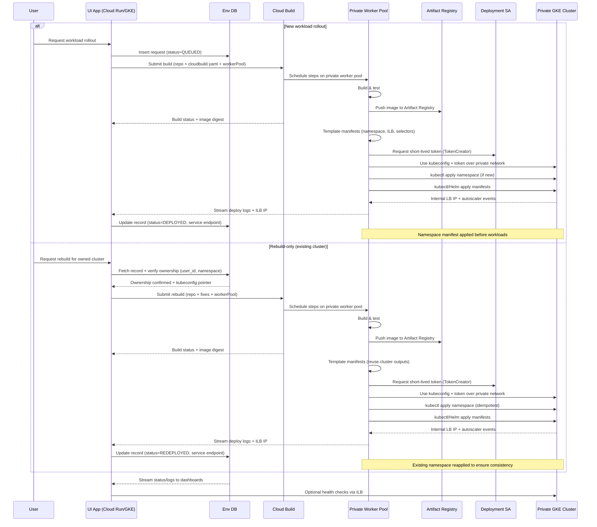

# Static Tenant Deployment Overview

This guide describes how a customer-facing control plane (Cloud Run, GKE, or VM) deploys and manages tenant workloads on top of **pre-provisioned** Google Cloud infrastructure. The shared platform already provides the VPC, private GKE cluster, CPU/GPU node pools, Cloud NAT, and Artifact Registry repository. Your app focuses on: collecting tenant input, running Cloud Build, templating manifests, impersonating a Kubernetes-only service account, storing request state, and applying workloads that can auto-scale across the existing CPU/GPU pools.

See `GCP-SERVICES.md` for a concise table of the Google Cloud services referenced throughout this document.

## Pre-Provisioned Assets

Platform engineering owns these static resources and keeps them healthy:

- Custom VPC + subnet ranges (primary + secondary) with Cloud NAT/firewalls.
- Private GKE cluster (private endpoint + nodes) with distinct CPU and GPU node pools configured for autoscaling.
- Artifact Registry repository for tenant/container images.
- Observability stack (Cloud Logging/Monitoring, GKE Metrics Server) already turned on.
- Secret Manager entry (or mounted file) containing a kubeconfig bound to the Deployment Service Account (SA).
- Cloud Build private worker pool that sits on the same VPC so builds and kubectl stages can reach the private cluster without public ingress.

## Components

1. **UI/App tier** – Cloud Run service, GKE control-plane, or VM-based API that receives tenant requests.
2. **Deployment SA** – Service account with no broad project access; mapped to Kubernetes RBAC (`ClusterRole`/`Role`) and granted `roles/iam.serviceAccountTokenCreator` for impersonation.
3. **Request datastore** – Cloud SQL / Firestore / Spanner record of every tenant environment, including build IDs, manifests, ILB endpoints, and lifecycle status.
4. **Cloud Build + private worker pool** – Cloud Build triggers execute on the dedicated worker pool inside the tenant VPC so the same pipeline can build/push images and run kubectl against the private cluster.
5. **Manifest templater** – In-app logic (Jinja, Kustomize, kpt) or a Cloud Build step that injects tenant-specific values (namespaces, labels, ILB annotations, GPU selectors) before the deploy stage executes on the worker pool.
6. **Private connectivity** – Serverless VPC Connector, VPC peering, or bastion path that lets the app observe health/metrics on the private endpoint (the private worker pool already has VPC access for kubectl).

## Control Plane Delivery & CI/CD

- **GitHub as source** – The control-plane code base resides in GitHub; merge policies there gate every change to the UI/API layer that orchestrates tenant deployments.
- **GitHub Actions pipeline** – Actions builds/tests the control-plane container, pushes to Artifact Registry, and deploys to either Cloud Run (with a Serverless VPC Connector) or a management GKE cluster. The workflow relies on Workload Identity Federation or short-lived impersonation tokens, never long-lived keys.
- **Traffic front door** – Regardless of runtime, Application Gateway terminates HTTPS using Google-managed SSL certificates and routes traffic to Cloud Run or management GKE services. The same gateway can expose shared dashboards or admin APIs under distinct paths/hosts.
- **Cloud Build integration** – Once deployed, the control-plane app is the only component that calls Cloud Build. End users never touch Cloud Build directly; the UI authenticates with the necessary IAM roles and sets the Terraform-emitted `worker_pool_id` on every build request.

## Deployment Flow Diagram



## Routing, TLS, and Monitoring

- **Application Gateway with managed SSL** – Provides the HTTPS entry point for the control-plane UI, Cloud Run services, and optional admin APIs. Google-managed certificates rotate automatically, so app teams never handle TLS secrets.
- **Internal-only tenant access** – Tenant workloads remain fronted by internal HTTP(S)/TCP load balancers. The Cloud Build deploy step captures each ILB IP and posts it back to the UI so the request datastore stays current.
- **Cloud Monitoring & Logging** – Use Cloud Monitoring dashboards and alerting policies (optionally Managed Service for Prometheus) to watch GKE utilization, Cloud Build job health, Application Gateway latencies, and control-plane KPIs. Cloud Logging aggregates build logs, App Gateway access logs, and namespace deploy output for troubleshooting.
- **Synthetic probes** – Configure Cloud Monitoring uptime checks or scheduled Cloud Run jobs that call each ILB through the management VPC; persist probe results next to the ILB IP for tenant-facing health transparency.

## Detailed Steps

1. **App scope & identity**
   - Deploy the control-plane app with network reach to the private cluster.
   - Grant the runtime identity `roles/iam.serviceAccountTokenCreator` on the Deployment SA.
  - Store the kubeconfig (already wired to the Deployment SA’s RBAC user) in Secret Manager or a private bucket so Cloud Build can download it during the deploy step.
  - Grant the Cloud Build service account `roles/iam.serviceAccountTokenCreator` on the Deployment SA and `roles/secretmanager.secretAccessor` (or storage equivalent) on the kubeconfig artifact.

2. **Request intake**
   - Persist each request with: tenant metadata, desired image/repo, namespace, resource sizing, GPU/CPU pool preference, and desired autoscaling limits.
  - Assign lifecycle statuses (`QUEUED`, `BUILDING`, `READY_TO_DEPLOY`, `DEPLOYED`, `FAILED`, `REBUILDING`, `REDEPLOYING`, `REDEPLOYED`, `DECOMMISSIONED`).
  - Store `user_id` (or similar identity) on each record so later rebuilds can be authorized against the original owner.
  - Track the worker pool resource string (and kubeconfig secret) per tenant so build triggers can set `options.workerPool` without special casing.

3. **Container build**
   - Fill substitutions for repo URL, Dockerfile path, and pre-created Artifact Registry repo name.
   - Trigger Cloud Build via API (`projects.locations.builds.create`) or `gcloud builds submit`.
   - Cloud Build service account needs `roles/artifactregistry.writer` and read access to source.
   - Emit image URI + digest back to the UI for manifest templating.
  - Set `options.workerPool` (or the trigger-level override) to the private worker pool so that later steps already run inside the tenant VPC.

4. **Rebuild-only / redeploy path**
  - Offer a "Rebuild & Deploy" action in the UI for clusters/namespaces already provisioned. This action should only be enabled when the datastore shows the requesting `user_id` owns the record and the status is `READY_TO_DEPLOY`, `DEPLOYED`, or `FAILED`.
  - When triggered, read the stored kubeconfig pointer, namespace, worker pool ID, and previous image digest; if the `user_id`, `tenant_id`, or namespace does not match the signed-in principal, abort with a 403-style error. When validation passes, update status to `REBUILDING` before submitting a new Cloud Build with `workerPool` set to the stored ID.
  - The Cloud Build pipeline handles both the redeploy build and the deploy step. Surface Pub/Sub notifications or webhook callbacks from the build log to flip the UI status to `REDEPLOYING` when the job reaches the kubectl step.
  - Publish Cloud Build IDs/log URLs and deploy artifacts back to the datastore so users can diagnose failed runs and retry without touching shared infrastructure.
  - On success, mark status `REDEPLOYED`, keep the new image digest, and persist any ILB IP that the worker pool step returns; on failure store the error but leave the cluster available for another rebuild.

5. **Manifest templating**
   - Merge tenant inputs with image metadata, GPU needs, ILB annotations, config maps, secrets, and autoscaling thresholds.
   - Enforce node scheduling controls:
     - `nodeSelector` / `affinity` for `pool: gpu` or `pool: cpu`.
     - Tolerations for `workload=gpu:NoSchedule` when targeting the GPU pool.
   - Inject labels/annotations for ownership, quota, and network policy selectors.
  - Render a dedicated `Namespace` manifest (one per tenant) so creation is declarative and idempotent.
  - Run this templating as a Cloud Build step whenever possible so the inputs that are rendered are the same ones the worker pool later applies.

6. **Deployment execution**
  - The Cloud Build deploy step runs on the private worker pool; have it impersonate the Deployment SA (`gcloud auth print-access-token --impersonate-service-account=$DEPLOY_SA`) and patch the kubeconfig secret with the returned token before exporting `KUBECONFIG`.
  - Apply the namespace manifest first (`kubectl apply -f namespace.yaml`) to ensure the tenant namespace exists, then apply the remaining workloads (`kubectl apply -f bundle/`, Helm, or kpt) from that same step.
  - Use the same worker pool for read operations (capturing ILB IPs, verifying HPAs) so no additional bastion is required for deployment automation.

7. **Autoscaling & GPU utilization**
   - CPU/GPU node pools already have cluster autoscaler enabled by platform ops; your manifests just need correct selectors and resource requests (`nvidia.com/gpu`).
   - Define `HorizontalPodAutoscaler` (or `KedaScaledObject`) so workloads react to load; the autoscaler scales pods, and the node pool scales nodes within its min/max envelope.

8. **Service exposure**
   - Create `Service` objects of `type: LoadBalancer` with `networking.gke.io/load-balancer-type: Internal` so ILB IPs stay inside the VPC.
  - Capture the resulting IP via `kubectl get svc ... -o jsonpath` from the worker-pool deploy step and persist it in the datastore for downstream services.

9. **Lifecycle updates**
   - Update your request record at each hand-off (post-build, post-deploy) and attach log URLs, ILB IPs, and failure reasons.
   - For teardown, read the metadata record, delete Kubernetes namespaces/resources, purge Cloud Build artifacts, and mark status `DECOMMISSIONED`.

## Request Tracking Schema

| Field | Purpose |
|-------|---------|
| `request_id` | Unique identifier per tenant action. |
| `tenant_id` | Logical grouping or account. |
| `user_id` | Authenticated principal that owns the namespace/cluster entry; required for rebuild authorization. |
| `namespace` | Target namespace within the shared cluster. |
| `cluster_name` | Reference to the backing GKE cluster (if multiple clusters exist). |
| `image_uri` / `image_digest` | Artifact Registry path emitted by Cloud Build. |
| `manifest_path` | GCS/Repo location of the rendered manifests. |
| `service_endpoint` | Internal Load Balancer IP or DNS. |
| `status` | `QUEUED`, `BUILDING`, `READY_TO_DEPLOY`, `DEPLOYED`, `FAILED`, `REBUILDING`, `REDEPLOYING`, `REDEPLOYED`, `DECOMMISSIONED`, etc. |
| `kubeconfig_secret` | Pointer to Secret Manager entry holding kubeconfig/token metadata. |
| `worker_pool_id` | Cloud Build worker pool resource string used during deployments. |
| `build_id` | Cloud Build ID for auditing & retries. |
| `autoscaling_profile` | JSON blob describing HPA/KEDA settings. |
| `updated_at` | Timestamp for dashboards/SLOs. |

Use change streams (Firestore listeners, Pub/Sub fan-out, Cloud SQL notifications) to keep the UI synchronized and to trigger retries or cleanup jobs. Before exposing any "Rebuild & Deploy" action, fetch the record by (`request_id` or `cluster_name`, `tenant_id`, `user_id`) and deny the rebuild if ownership does not match the caller. The stored `worker_pool_id` should feed directly into the Cloud Build request (`options.workerPool`) so workloads always deploy from the private pool.

## Sample Python Service Layer (Cloud SQL)

```python
import json
from sqlalchemy import create_engine, text

ENGINE = create_engine(
    "postgresql+pg8000://dbuser:dbpass@/envdb",
    connect_args={"unix_sock": "/cloudsql/PROJECT:REGION:INSTANCE/.s.PGSQL.5432"},
    pool_pre_ping=True,
)

def upsert_env(record):
  with ENGINE.begin() as conn:
    conn.execute(
      text(
        """
        INSERT INTO environments (request_id, tenant_id, user_id, namespace, status,
                 image_uri, service_endpoint, worker_pool_id, autoscaling_profile)
        VALUES (:request_id, :tenant_id, :user_id, :namespace, :status,
          :image_uri, :service_endpoint, :worker_pool_id, :autoscaling_profile::jsonb)
        ON CONFLICT (request_id)
        DO UPDATE SET
          status = EXCLUDED.status,
          image_uri = EXCLUDED.image_uri,
          service_endpoint = EXCLUDED.service_endpoint,
          worker_pool_id = EXCLUDED.worker_pool_id,
          autoscaling_profile = EXCLUDED.autoscaling_profile,
          updated_at = NOW()
        """
      ),
      record,
  def assert_owner_and_fetch(request_id, user_id):
    with ENGINE.begin() as conn:
      row = conn.execute(
        text(
          """
          SELECT * FROM environments
          WHERE request_id = :request_id
          FOR UPDATE
          """
        ),
        {"request_id": request_id},
      ).mappings().first()

    if not row:
      raise ValueError("unknown request")
    if row["user_id"] != user_id:
      raise PermissionError("requested namespace is not owned by caller")
    return row

  def trigger_rebuild(request_id, user_id):
    record = assert_owner_and_fetch(request_id, user_id)
    namespace = record["namespace"]
    status = record["status"]
    if status not in {"READY_TO_DEPLOY", "DEPLOYED", "FAILED"}:
      raise RuntimeError("rebuild not allowed in current state")

    upsert_env({**record, "status": "REBUILDING"})
    build = launch_cloud_build({
      **record,
      "worker_pool": record.get("worker_pool_id"),
      "namespace": namespace,
      "kubeconfig_secret": record.get("kubeconfig_secret"),
    })
    if build["status"] != "SUCCESS":
      upsert_env({**record, "status": "FAILED", "last_error": build.get("failure_info")})
      return build

    upsert_env({
      **record,
      "status": "REDEPLOYED",
      "image_uri": build.get("image_uri", record.get("image_uri")),
      "service_endpoint": build.get("service_endpoint", record.get("service_endpoint")),
    })

    )
```

Add helper functions to track build IDs, ILB IPs, and failure reasons, mirroring the workflow described earlier.

## Cloud Build Integration

- Reuse the existing Artifact Registry repo name (no infra changes required).
- Dynamically generate `cloudbuild.yaml` to:
  1. Clone source.
  2. Build & push image.
  3. Patch manifests with `${_IMAGE}`.
  4. Upload rendered manifests to GCS or return them via Cloud Build artifacts.
- Always set `options.workerPool` to the shared private worker pool so the deploy step reaches the private endpoint; this also keeps build artifacts off the public internet.
- Required roles for the Cloud Build SA now include `roles/artifactregistry.writer`, `roles/storage.objectAdmin` (if storing rendered manifests), `roles/secretmanager.secretAccessor` (or equivalent) for the kubeconfig secret, and `roles/iam.serviceAccountTokenCreator` on the Deployment SA.
- Emit ILB IPs and build IDs as artifacts (GCS object, Pub/Sub message, or webhook callback) so the UI can update its datastore without opening direct access to the private cluster.

## Kubernetes Deployment Snippet

```yaml
apiVersion: v1
kind: Namespace
metadata:
  name: tenant-a
  labels:
    tenant: tenant-a
---
apiVersion: v1
kind: Service
metadata:
  name: tenant-api
  namespace: tenant-a
  annotations:
    networking.gke.io/load-balancer-type: Internal
spec:
  type: LoadBalancer
  selector:
    app: tenant-api
  ports:
    - name: http
      port: 80
      targetPort: 8080
---
apiVersion: apps/v1
kind: Deployment
metadata:
  name: tenant-api
  namespace: tenant-a
spec:
  replicas: 1
  selector:
    matchLabels:
      app: tenant-api
  template:
    metadata:
      labels:
        app: tenant-api
    spec:
      nodeSelector:
        pool: gpu
      tolerations:
        - key: workload
          value: gpu
          effect: NoSchedule
      containers:
        - name: api
          image: us-central1-docker.pkg.dev/PROJECT/tenant-images/tenant-api:TAG
          resources:
            requests:
              cpu: 500m
              memory: 1Gi
              nvidia.com/gpu: 1
            limits:
              cpu: 1000m
              memory: 2Gi
              nvidia.com/gpu: 1
---
apiVersion: autoscaling/v2
kind: HorizontalPodAutoscaler
metadata:
  name: tenant-api
  namespace: tenant-a
spec:
  scaleTargetRef:
    apiVersion: apps/v1
    kind: Deployment
    name: tenant-api
  minReplicas: 1
  maxReplicas: 5
  metrics:
    - type: Resource
      resource:
        name: cpu
        target:
          type: Utilization
          averageUtilization: 70
```

Adjust `nodeSelector` / tolerations to `pool: cpu` when GPUs are unnecessary. Because node pools are pre-warmed and autoscaler-enabled, workloads will scale horizontally while the platform handles underlying node growth.

## Operational Notes

- **Secrets**: Store kubeconfigs and per-tenant values in Secret Manager; rotate regularly.
- **Auditing**: Enable Cloud Audit Logs for `ServiceAccountTokenCreator` to trace who impersonated Deployment SA.
- **Quotas**: Monitor node pool quotas; the control-plane should refuse deployments that exceed reserved GPU stock.
- **Health checks**: Continuously probe the ILB endpoints from the management VPC and attach results to the request record.
- **Cleanup**: Provide `destroy` actions that delete namespaces, Cloud Build artifacts, and request metadata without touching the shared infrastructure.
